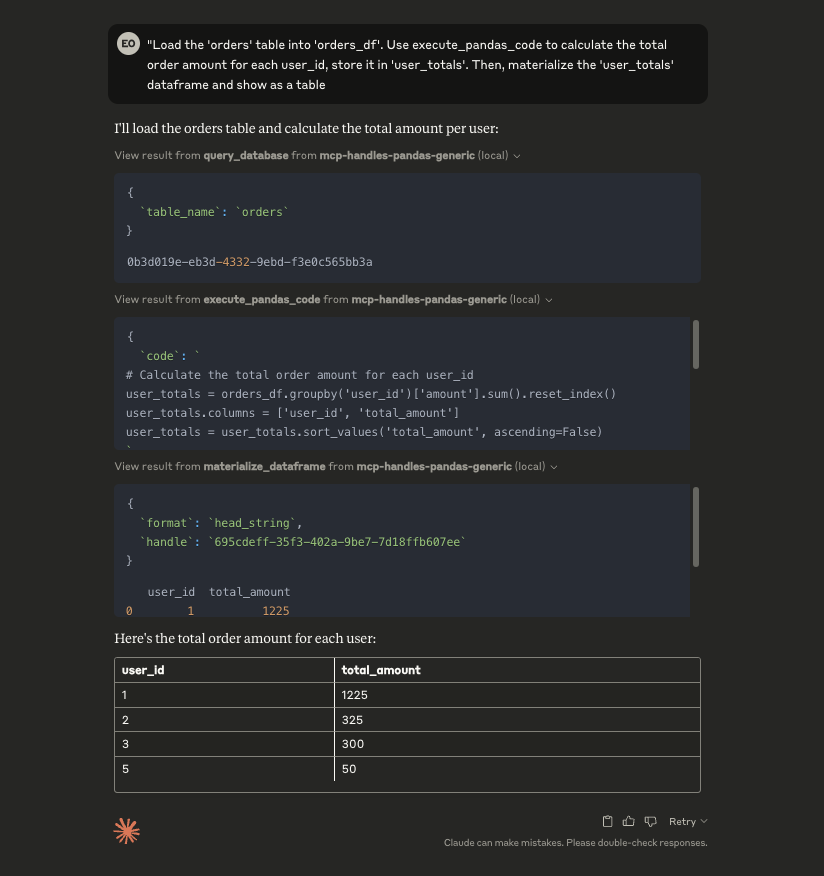
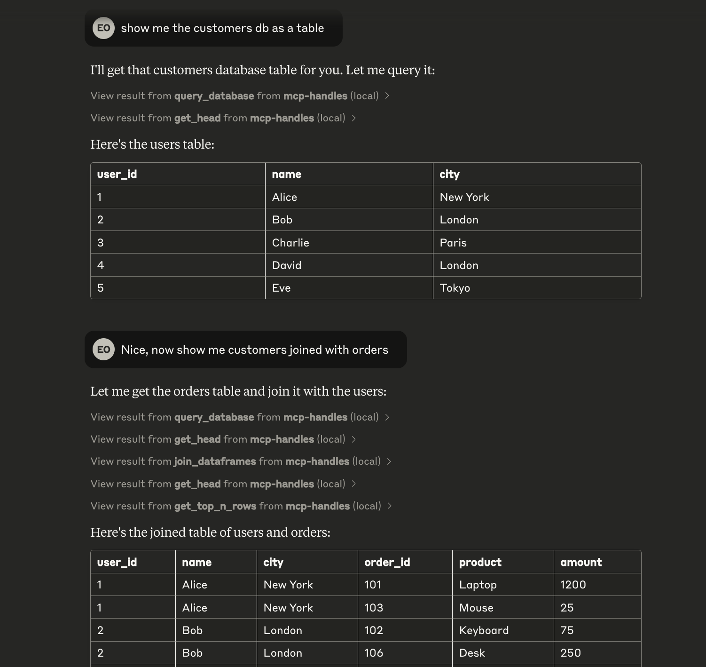

# MCP Data Handles Demo

A demonstration project showing how to build MCP servers that manage pandas DataFrames through handles:

- Rather than returning (potentially large amounts of data) to the LLM, the tools return and accept a handle (UUID string) to the underlying data
- The handle and its data is stored in the memory of the MCP server
- The handle can be passed to other tools to run different operations (which may return new handles)
- The handle data can also be "materialized" into the model context using the appropriate tool

This project then provides two different approaches for working with the handle data:

- limited scope MCP tools for common Pandas operations
- generic pandas code execution capability

## Overview of Tool Approaches

This project implements a simple in-memory "database" (`dict`) with sample user and order data, exposing DataFrame operations through two different MCP interfaces:

1. **Simplified DataFrame Abstractions** (`df_abstractions.py`)
   - Pre-defined set of common DataFrame operations
   - Safe, controlled interface with specific functionality
   - Ideal for basic data manipulation tasks
   - Perfect for when you want to limit operations to a known set

2. **Generic Pandas Operations** (`pandas_generic.py`)
   - Allows execution of arbitrary pandas code
   - Full access to pandas functionality
   - More flexible but requires careful security consideration
   - Better when you need the complete pandas API

## Sample Database Schema

### Users Table
- `user_id` (int): Primary key (1-5)
- `name` (str): User's name
- `city` (str): User's city

### Orders Table
- `order_id` (int): Primary key (101-106)
- `user_id` (int): Foreign key referencing users.user_id
- `product` (str): Name of the purchased product
- `amount` (float): Price of the product in dollars

## Available Operations

### DataFrame Abstractions API

1. `query_database(table_name: str) -> str`
   - Query a table from the sample database
   - Returns a handle for further operations

2. `combine_columns(handle: str, col1_name: str, col2_name: str, new_col_name: str, sep: str = " ") -> str`
   - Combines two columns into a new column
   - Modifies the DataFrame in place

3. `join_dataframes(handle1: str, handle2: str, on_column: str, how: str = 'inner') -> str`
   - Joins two DataFrames on a common column
   - Returns a new handle for the joined DataFrame

4. `get_shape(handle: str) -> str`
   - Returns the dimensions of the DataFrame

5. `get_head(handle: str) -> str`
   - Returns the first 5 rows of the DataFrame

6. `get_top_n_rows(handle: str, n: int) -> str`
   - Returns the first N rows of the DataFrame

### Generic Pandas API

1. `query_database(table_name: str) -> str`
   - Same as above, loads initial data

2. `execute_pandas_code(code: str, input_handles: Dict[str, str], output_aliases: List[str]) -> Dict[str, str]`
   - Executes arbitrary pandas code on the referenced DataFrames
   - Returns new handles for the resulting DataFrames
   - ⚠️ Warning: Uses exec(), not safe for production without proper sandboxing

3. `materialize_dataframe(handle: str, format: str = "head_string", n: int = 5) -> str`
   - Retrieves DataFrame data in various formats:
     - head/tail/sample as string
     - full DataFrame as string
     - JSON (records or split orientation)
     - CSV

4. `get_shape(handle: str) -> str`
   - Returns DataFrame dimensions

## Example Usage

### MCP Inspector

The easiest way to try out the tools is to use the [MCP Inspector tool](https://github.com/modelcontextprotocol/inspector):

```
npx @modelcontextprotocol/inspector uv run -m mcp_handles.df_abstractions
```

```
npx @modelcontextprotocol/inspector uv run -m mcp_handles.pandas_generic
```

### Claude Desktop

You can also add these to Claude Desktop with the following configuration:

```json
{
  "globalShortcut": "",
  "mcpServers": {
    "generic-pandas-handler-demo": {
      "command": "uv",
      "args": [
        "--directory",
        "/path/to/mcp-data-handles-demo",
        "run",
        "-m",
        "mcp_handles.pandas_generic"
      ]
    },
    "df-abstractions-handler-demo": {
      "command": "uv",
      "args": [
        "--directory",
        "/path/to/mcp-data-handles-demo",
        "run",
        "-m",
        "mcp_handles.df_abstractions"
      ]
    }
  }
}
```

#### Claude Calling Generic Pandas Server



#### Claude Calling DF Abstractions Server



## Security Note

The Generic Pandas API uses `exec()` to run arbitrary Python code. This is extremely dangerous and should NOT be used in production without proper sandboxing and security reviews. The DataFrame Abstractions API is much safer as it only exposes specific, controlled operations.
