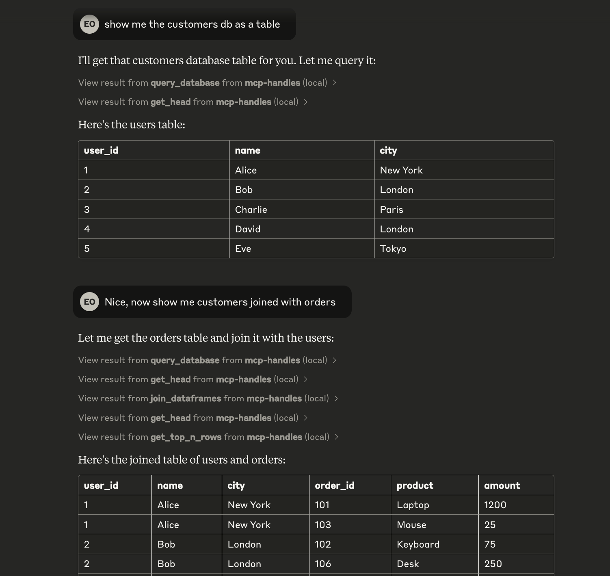

# MCP Data Handles Demo

A demonstration project showing how to build an MCP server that manages pandas DataFrames through handles. This server allows Claude to work with tabular data while maintaining state between operations.

## Overview

This project implements a simple in-memory "database" (`dict`) with sample user and order data, exposing several DataFrame operations through an MCP interface. It's designed to work with Claude Desktop and other MCP-compatible clients.

## Features

- Query sample tables (users and orders)
- Join DataFrames on common columns
- Combine columns with custom separators
- View DataFrame information (shape, head, top N rows)
- Stateful operations using UUID handles

## Sample Database Schema

### Users Table
- `user_id` (int): Primary key (1-5)
- `name` (str): User's name
- `city` (str): User's city

### Orders Table
- `order_id` (int): Primary key (101-106)
- `user_id` (int): Foreign key referencing users.user_id
- `product` (str): Name of the purchased product
- `amount` (float): Price of the product in dollars

## Example in Claude Desktop

## Available Operations

1. `query_database(table_name: str) -> str`
   - Query a table from the sample database
   - Returns a handle for further operations

2. `combine_columns(handle: str, col1_name: str, col2_name: str, new_col_name: str, sep: str = " ") -> str`
   - Combines two columns into a new column
   - Modifies the DataFrame in place

3. `join_dataframes(handle1: str, handle2: str, on_column: str, how: str = 'inner') -> str`
   - Joins two DataFrames on a common column
   - Returns a new handle for the joined DataFrame

4. `get_shape(handle: str) -> str`
   - Returns the dimensions of the DataFrame

5. `get_head(handle: str) -> str`
   - Returns the first 5 rows of the DataFrame

6. `get_top_n_rows(handle: str, n: int) -> str`
   - Returns the first N rows of the DataFrame

